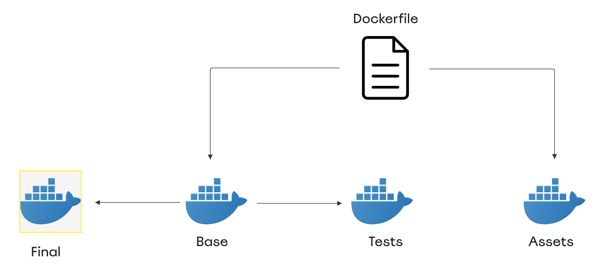

# The Build Process

Hover starts a new build by creating a fresh `out` directory inside the `.hover` directory. Inside this directory, Hover does the following:

1. Add the runtime files inside a `hover_runtime` directory.
2. Copies the content of the encrypted secrets file into a `.env` file.
3. Encodes the content of the manifest file into a `manifest.json` file.

Inside the `manifest.json` file, Hover stores a unique build ID that is used as a name for the docker image tag and assets bucket directory.

Now that the `out` directory is ready, Hover starts building the docker image(s).

## Docker

The `.Dockerfile` created by the `stage new` command utilizes Docker's multi-stage builds to build four stages:

### The Base Stage

This one includes the required libraries to run the application and also run the tests.

### The Assets Stage

This one is used to compile the asset files of your application and move the output to the `./hover/out/assets` directory. This directory is then uploaded to the S3 bucket during the deployment.

### The Tests Stage

This stage runs your tests inside the base docker image.

The default command that runs is `vendor/bin/phpunit`. You can change it to whatever you want. You can also install any testing dependencies you need by updating the stage inside the Docker file.

You can skip running tests by using the `--skip-tests` flag on the `hover build` command.

### The Final Stage

This is the stage that gets tagged and then published to AWS ECR to be run by your functions.

The default dockerfile includes a step that runs `composer install --no-dev` to remove any dev-related dependencies from your build's vendor directory.

In this stage, a `prepare.sh` executable is executed. Which performs some housekeeping needed prior to deployment. You can find the code that runs in [this file](/embeds/stubs/hover_runtime/prepare.sh).



## Build Sequence

Hover starts by running `docker build --tag=<stage>:<build_id> .`, which builds the base stage as well as the final stage.

After that, it checks if it's supposed to run tests. In that case it builds the tests stage, tags it with `latest-tests` and runs the tag.

```shell
docker build --target=tests --tag=<stage>:latest-tests

docker run --rm <stage>:latest-tests
```

If the tests fails, the `hover build` command will return the errors. Otherwise, it will move to building the assets stage:

```shell
docker build --target=assets --tag=<stage>:latest-assets
```

Finally, Hover hover runs the assets tag and mounts the `.hover/out/assets` directory. The command the container runs copies the asset compiling output to the mounted volume:

```shell
docker run --rm -v /PATH/TO/.hover/out/assets:/out <stage>:latest-assets cp -R public/. /out
```

At the end of the build, the final tag will be ready on the host machine under the naming convention of `<stage>:<build_id>` and the compiled assets files will be stored in the `.hover/out/assets` directory.
