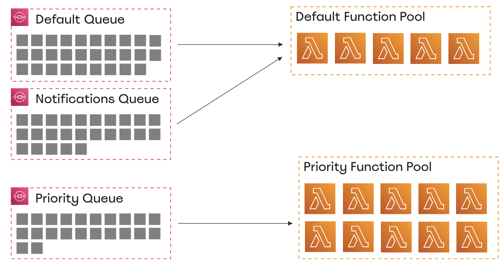

# Working with Queues

The [runtime guide](/runtime-environment.md#the-queue-runtime) explains how the Hover runtime handles incoming invocations from the Lambda-SQS integrations. In this document, we will look into how you may utilize Hover to manage the different queues defined by your application.

Let's take a look at this example queue configuration extracted from the manifest file of a Hover stage:

```yaml
queue:
  default:
    memory: 512
    timeout: 120
    concurrency: 5
    tries: 3
    backoff: "5, 10"
    queues:
      - default
      - notifications
  priority:
    memory: 512
    timeout: 300
    concurrency: 10
    tries: 5
    backoff: "1"
    queues:
      - priority
```

Reading these configurations, Hover will create two Lambda functions and configures the event source mappings to invoke the `default` function when jobs are available in the `default` and `notifications` queues, and the `priority` function when jobs are available in the `priority` queue.

Since the same AWS account can be used to run multiple stages and multiple applications, Hover needs to give a unique name for each queue so that functions from another stage/application won't accidentally process jobs from the wrong queue.

The naming convention Hover uses looks like this:

```
[queue_name]-[project_name]-[stage_name]

// Example
priority-clouder-staging
```

To allow you to use short queue names in your application code, like you'd usually do in a non-serverless setup, Hover utilizes the `SQS_PREFIX` and `SQS_SUFFIX` environment variables to convert the short queue name in the Laravel code base to the actual queue name when interacting with SQS.

So a queue named `priority` in the code base, will be translated to the following:

```
https://sqs.<region>.amazonaws.com/<account>/priority-clouder-staging
```

This allows you to push to a `priority` queue in your code, and Hover will send the job to the `priority` queue of the stage the job was pushed from.

```php
dispatch()->onQueue('priority');
```

## Handling Concurrency

Lambda functions in a single region of an AWS account shares a limit of maximum concurrent invocations. This limit is 1000 by default and can be raised by contacting AWS support.

You'd typically want to manage these concurrency slots wisely so that there are enough HTTP functions to handle concurrent requests, enough CLI functions to handle the scheduler and manual command invocations, and enough queue functions to process jobs concurrently from the different queues.

For all function types, you may use the `concurrency` attribute to reserve a number of slots for that function. This guarantees the function will always have available concurrency slots reserved from the [per-region concurrency limit](https://docs.aws.amazon.com/lambda/latest/dg/gettingstarted-limits.html).

When dealing with queues, you can choose to not set any reserved concurrency on the queue functions. This guarantees the function concurrency can scale to occupy all the available concurrency slots. But this also means the function may be starved of slots if there are multiple other functions in the same region requiring too many slots.

It is generally a good idea to use reserved concurrency with queue Lambdas in order not to cause resource starvation. You can allocate more concurrency slots to queues with high priority jobs and fewer slots for queues with low priority jobs.

Separating the handling of different queues also avoids the possibility of one low priority queue to eat all available slots and delay processing jobs in a high priority queue.



Given the example above, jobs in the `default` and `notifications` queues are fighting over the available 5 concurrency slots of the default queue function. While the `priority` jobs have their own dedicated 10-slot pool.
